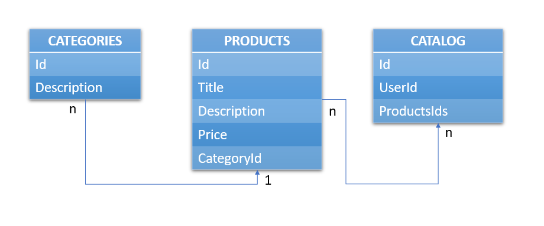

<h1>Backend Analyst Candidate Testing</h1>

  API desenvolvida para teste de candidato a analista backend para a empresa **Anota Aí!**.

<strong>Como iniciar a API?</strong>

  A API poderá ser inicializada utilizando o comando no terminal:
ˋˋˋ
npm run dev
ˋˋˋ

<strong>Como acessar as rotas?</strong>

  A API roda localmente no endereço:
ˋˋˋ
http://localhost:3000/
ˋˋˋ
  As rotas disponíveis podem ser encontradas acessando:
ˋˋˋ
localhost:3000/api-docs
ˋˋˋ

<strong>Qual a interpretação das User Stories?</strong>

  Com base nas histórias de usuários, foram criadas três tabelas, onde:

  As rotas imaginadas para as histórias, foram:

  1. _"As a user I would like to register a product so that I can have access to the data of this product in the future (Title, description, price, category)"_
    O usuário será capaz de registrar um produto através da rota:
ˋˋˋ
http://localhost:3000/products (Post)
ˋˋˋ
    E obter a listagem de seus dados em:
ˋˋˋ
http://localhost:3000/products/:productId (Get)
ˋˋˋ
  2. _"I as a user would like to be able to associate and edit a product category"_
    Para associar uma categoria a um produto, o usuário deverá acessar a rota:
ˋˋˋ
http://localhost:3000/products/:productId (Put)
ˋˋˋ
onde poderá editar o produto e assim alterar a categoria.
    Para editar a categoria, o acesso encontra-se em:

ˋˋˋ
http://localhost:3000/categories/:categoryId (Put)
ˋˋˋ
  3. _"As a user I would like to be able to access the list of all products"_
  Para acessar a listagem de todos os produtos, o usuário deverá acessar:
ˋˋˋ
http://localhost:3000/products (Get)
ˋˋˋ
  4. _"As a user I would like to be able to filter products by name or category"_
  Para realizar o filtro por nome ou categoria do produto, o usuário poderá acessar:
ˋˋˋ
http://localhost:3000/products (Get)
ˋˋˋ
  O filtro desejado deverá ser passado através de query params

  5. _"I as a user would like to be able to update the product data"_
  Para a edição dos dados do produto, o acesso encontra-se em:
ˋˋˋ
http://localhost:3000/products/:productId (Put)
ˋˋˋ
  6. _"I as a user would like to be able to delete a product from my catalog"_
  Para a exclusão de um produto do catálogo do cliente, o acesso deverá ser feito em:
ˋˋˋ
http://localhost:3000/catalogs/:catalogId/product/:productId (Delete)
ˋˋˋ
<strong>O que foi utilizado no desenvolvimento?</strong>

Foram utilizados:
- NodeJS;
- Express;
- Mongoose para o MongoDB;
- Swagger para a documentação;
- Winston para logs;